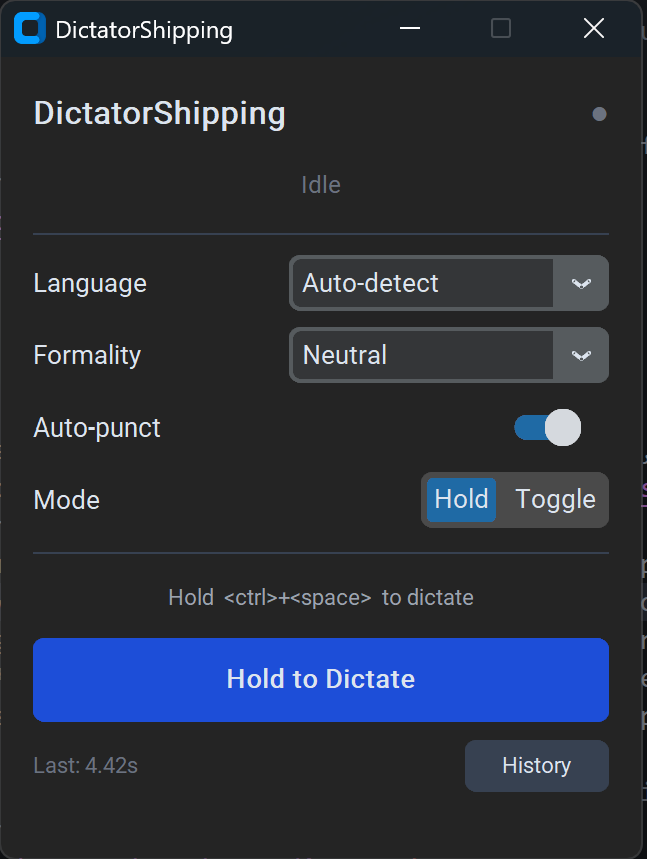
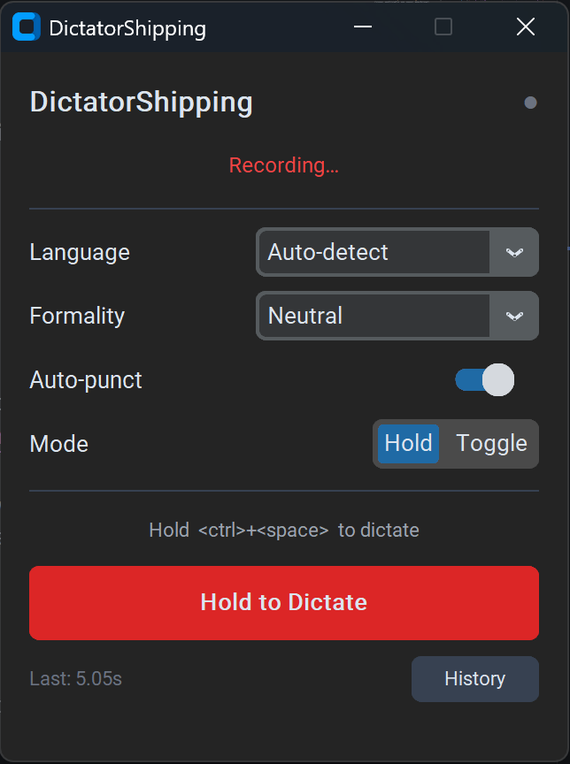
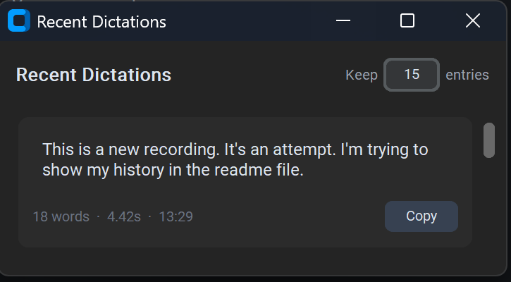

# DictatorShipping 🎙️

Description:
Run the app, then side to the app you want to dictate to (txt, browser, llm, cli, any textbox), hold ctrl+space while talking, release to get the transcript written. Access previous transcripts in history and copy them. Defaults to autodetect language but can be picked; Defaults to normal transcription, but ollama can be called to go from neutral to formal or casual.
In the first run, it will download the language model (300mb estimated).

<div align="center">
  <figure>
    <div style="text-align: center;">
      
    </div>>
    <figcaption><em>Figure 0: AMAZING Beautiful logo</em></figcaption>
  </figure>
</div>

---

> Hold a hotkey, speak, release — text appears wherever your cursor is.
> Fully offline. No cloud. No subscriptions.

<!-- SCREENSHOT: Main app window (idle state, showing the full UI with icon, status pill, settings card, and record button) -->
<div align="center">
  <figure>
    <div style="text-align: center;">
      
    </div>
    <figcaption><em>Figure 1: Main app window (idle state)</em></figcaption>
  </figure>
</div>

---

## Features

- **Hold-to-dictate or toggle mode** — press once to start, again to stop
- **Offline speech recognition** via [faster-whisper](https://github.com/SYSTRAN/faster-whisper) (runs entirely on your machine)
- **Live waveform** with automatic silence detection — stops recording when you stop talking
- **Formality rewriting** — optionally rewrite output as Formal or Casual via a local Ollama LLM
- **Multi-language** — auto-detect or pin to a specific language
- **System tray** — lives in the background, hotkey works even when the window is hidden
- **Dictation history** — last N entries with one-click copy

<!-- SCREENSHOT: App during active recording (waveform visible, red recording button, status showing "Recording…") -->
<div align="center">
  <figure>
    <div style="text-align: center;">
      
    </div>
    <figcaption><em>Figure 2: Recording interface showing key features</em></figcaption>
  </figure>
</div>

<!-- SCREENSHOT: History panel open alongside the main window -->
<div align="center">
  <figure>
    <div style="text-align: center;">
      
    </div>
    <figcaption><em>Figure 3: History panel showing recent dictations</em></figcaption>
  </figure>
</div>

---

## Requirements

| | Minimum |
|---|---|
| OS | Windows 10+ or macOS 12+ |
| RAM | 4 GB (8 GB recommended for medium model) |
| Python | 3.11+ (not needed if using the packaged release) |
| Ollama | Optional — only needed for formality rewriting |

---

## Quick Start

### Option A — Download (Windows)

1. Download `DictatorShipping-windows.zip` from [Releases](../../releases)
2. Extract and double-click `DictatorShipping.exe`

### Option B — Run from source

```bash
# Windows
launch.bat

# macOS
chmod +x launch.command && ./launch.command
```

`launch.py` handles everything automatically on first run: creates a virtual environment, installs dependencies, and optionally pulls the Ollama model.

---

## Default Hotkey

`Ctrl + Space` — configurable via the Mode selector in the UI.

---

## Optional: Formality Rewriting

Install [Ollama](https://ollama.com), then:

```bash
ollama pull llama3.2
```

The app detects Ollama automatically. The green dot in the top-right confirms it's connected.

---

## Whisper Models

Set `whisper_model` in `settings.json` (located in `%APPDATA%\DictatorShipping\` on Windows):

| Model | Size | Speed | Accuracy |
|---|---|---|---|
| `tiny` | 75 MB | fastest | lower |
| `small` | 244 MB | fast | good |
| `medium` | 769 MB | moderate | great |
| `large-v3` | 1.5 GB | slow | best |

Default is `small`.

---

## License

[Apache 2.0](LICENSE)
